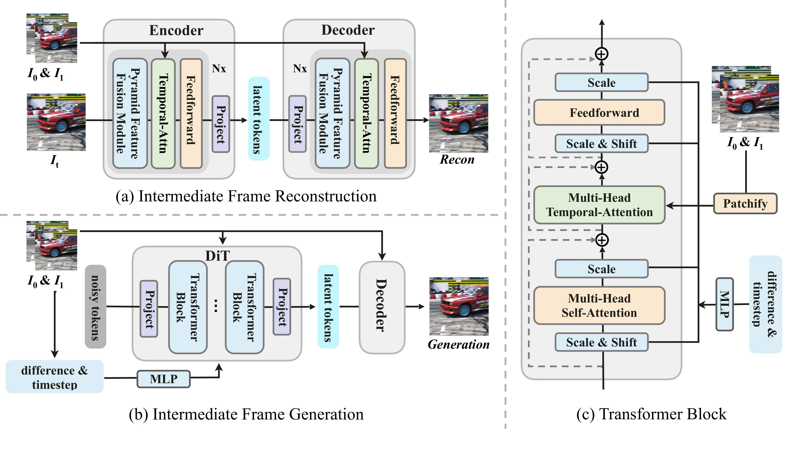

# EcoVideo

EcoVideo is the open-source inference path for frame-level entropy-orchestrated cloud-edge video generation. The released code keeps the main text-to-video pipeline:

```text
scripts/run_full_pipeline.py
  -> vdit.generators.wan_t2v / vdit.generators.cogvideo_t2v
  -> third_party/wan21 or third_party/wan22
  -> vdit.pipeline.run_iframe
  -> EDEN interpolation + interval scoring + greedy refinement
  -> final video
```

<p align="center">
  
</p>

## Features

- Attention-entropy-based keyframe selection.
- Optional non-keyframe context for temporally consistent keyframe denoising.
- EDEN-based interpolation from sparse keyframes to target FPS.
- Optional RAFT-based motion/occlusion interval scoring.
- Wan2.1, Wan2.2 and CogVideoX inference backends.

## Tested environment

The exact versions used for the paper should be filled in before release. The current release target is:

- Python 3.10
- PyTorch installed separately according to CUDA version
- CUDA-capable GPU for full generation
- `pip install -r requirements/base.txt` for EcoVideo runtime dependencies

## Installation

```bash
conda create -n ecovideo python=3.10 -y
conda activate ecovideo

# Choose the PyTorch command that matches your CUDA driver.
# Example for CUDA 12.1 wheels:
pip install torch torchvision torchaudio --index-url https://download.pytorch.org/whl/cu121

pip install -r requirements/base.txt

# Optional: install xformers only if a compatible wheel exists for your torch/CUDA.
# pip install xformers

export PYTHONPATH=$PWD/src:$PYTHONPATH
```

Check the environment:

```bash
PYTHONPATH=src python tools/check_env.py
```

## Model preparation

Prepare checkpoints and export paths:

```bash
export WAN21_CKPT=/path/to/Wan2.1-T2V-14B
export WAN22_CKPT=/path/to/Wan2.2-T2V-A14B
export COGVIDEO_CKPT=/path/to/CogVideoX-5b
export EDEN_CKPT=/path/to/eden.pt
export RAFT_CKPT=/path/to/raft-things.pth   # optional
```

`configs/eden_infer.yaml` is a template. The helper below creates a local config with the correct EDEN checkpoint path:

```bash
python tools/make_eden_config.py \
  --template configs/eden_infer.yaml \
  --eden_ckpt "$EDEN_CKPT" \
  --output outputs/eden_infer.local.yaml
```

## Quick start

### Wan2.1

```bash
WAN21_CKPT=/path/to/Wan2.1-T2V-14B \
EDEN_CKPT=/path/to/eden.pt \
RAFT_CKPT=/path/to/raft-things.pth \
bash scripts/infer_wan21.sh
```

### Wan2.2

```bash
WAN22_CKPT=/path/to/Wan2.2-T2V-A14B \
EDEN_CKPT=/path/to/eden.pt \
RAFT_CKPT=/path/to/raft-things.pth \
bash scripts/infer_wan22.sh
```

### CogVideoX

```bash
COGVIDEO_CKPT=/path/to/CogVideoX-5b \
EDEN_CKPT=/path/to/eden.pt \
RAFT_CKPT=/path/to/raft-things.pth \
bash scripts/infer_cogvideo.sh
```

If `RAFT_CKPT` is omitted, RAFT-based flow/occlusion scores are disabled. RGB and EDEN-difference scores still run.

## Manual command example

```bash
PYTHONPATH=src python scripts/run_full_pipeline.py \
  --generator wan \
  --wan_version 2.1 \
  --ckpt_dir /path/to/Wan2.1-T2V-14B \
  --prompt "A monkey is to the right of an apple, reaching out its hand to grab the apple." \
  --wan_task t2v-14B \
  --wan_size "1280*720" \
  --wan_frame_num 81 \
  --wan_sample_steps 50 \
  --wan_sample_solver unipc \
  --wan_guide_scale 5.0 \
  --wan_keyframe_by_entropy \
  --wan_entropy_steps 5 \
  --wan_entropy_mode ema \
  --wan_keyframe_target_fps 8 \
  --wan_use_nonkey_context \
  --eden_config outputs/eden_infer.local.yaml \
  --raft_ckpt /path/to/raft-things.pth \
  --target_fps 24 \
  --keyframe_mode all \
  --output_path outputs/wan21_ecovideo.mp4
```

## Reproducing paper-style results

The full paper reproduction requires the exact released checkpoints, prompts, hardware, and evaluation scripts. The minimum reproducible workflow is:

1. Generate sparse keyframes with entropy-based selection.
2. Run EDEN interpolation to the target FPS.
3. Save `*.metrics.json` for latency and pipeline statistics.
4. Evaluate generated videos with VBench or the metric suite used in the paper.

Example commands are provided in `scripts/infer_wan21.sh`, `scripts/infer_wan22.sh`, and `scripts/infer_cogvideo.sh`. Add the final benchmark prompt files and VBench wrapper before formal release.

## Code structure

```text
EcoVideo/
  assets/                  # pipeline and qualitative figures
  configs/                 # EDEN config template
  docs/                    # installation, reproduction, troubleshooting notes
  examples/                # example prompts
  requirements/            # dependency groups
  scripts/                 # public inference scripts
  src/vdit/                # EcoVideo pipeline code
  third_party/             # vendored Wan/RAFT components
  tools/                   # release/environment helper scripts
```

## Citation

If you find this project useful, please cite our paper. BibTeX will be updated upon publication.

```bibtex
@inproceedings{ecovideo2026,
  title     = {EcoVideo: Entropy-Orchestrated Cloud-Edge Video Generation},
  author    = {Anonymous},
  booktitle = {To appear},
  year      = {2026}
}
```

## License and third-party code

EcoVideo original code is intended to be released under the license selected by the authors. Third-party code under `third_party/` remains subject to the corresponding upstream licenses. Before making the repository public, fill in the exact license information in `LICENSE`, `NOTICE`, and `third_party/README.md`.
